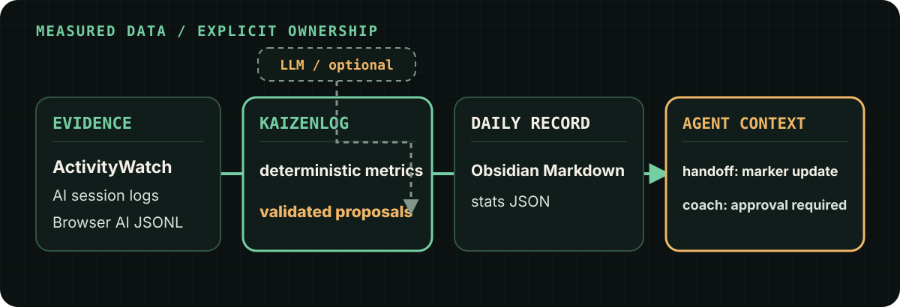

# KaizenLog

<p align="center">
  
</p>

**Windows の操作ログを毎晩まとめて、翌日に試せる改善アクションにする。**  
ActivityWatch + Obsidian + LLM。ローカルファースト。マーカー区間だけを更新するので手書きノートは残り続けます。

> Automatic Windows activity journal in Markdown, with LLM-powered daily improvement suggestions. Built on ActivityWatch. Local-first.

---

<p align="center">
  
</p>

| 夜 | 朝 | 日中 |
| --- | --- | --- |
| `kaizenlog run` が日誌と提案を書く | `morning` が 📌 と件数トースト | `today` / `done` で消化 |

- **計測は ActivityWatch に委譲** — 収集エンジンを再発明しない
- **提案は言いっぱなしにしない** — `KZN-…` ID、PASS/FAIL、消化率
- **LLM はテキストだけ** — ノート書き込みは常に KaizenLog（マーカー区間のみ）
- **ローカルファースト** — 活動データは PC 内。Ollama なら完全オフライン可

詳細な機能一覧・設定は [docs/USAGE.md](docs/USAGE.md) を参照してください。

---

<p align="center">
  
</p>

### 仕組み（要約）

1. **ActivityWatch** が前景アプリを常駐記録  
2. **`generate`** が分類・集計し、デイリーノートの Activity Log を更新  
3. **`advise`** が機械可読統計を根拠に JSON 提案 → 読みやすい Markdown へ  
4. **`morning` / `today`** が未完了アクションを届ける  
5. **`done`** とノートのチェックで消化率・翌日の自動判定へつなぐ  

---

<p align="center">
  
</p>

### 最短セットアップ

```powershell
pipx install kaizenlog       # または pip install kaizenlog
kaizenlog setup              # ボールト・LLM・AW・スキル・夜間/朝タスク
kaizenlog doctor             # 環境診断
kaizenlog run                # ActivityWatch 起動後に初回実行
```

`setup` は `%APPDATA%\kaizenlog\config.toml` に設定を書きます。手動設定・トラブルシュートは [docs/USAGE.md](docs/USAGE.md)。

### 日々のコマンド

```powershell
kaizenlog run                # 夜: 収集 + 提案（タスクスケジューラと同じ）
kaizenlog morning            # 朝: 追いつき + 📌 再描画 + 件数トースト
kaizenlog today              # 日中: 未完了アクション一覧（チェック同期込み）
kaizenlog done KZN-…001      # ターミナルから消化（末尾 001 でも可・一意時）
kaizenlog status             # 実行ログ・提案ヘルス・消化率
```

### LLM バックエンド

指定バックエンドが使えない場合は **Ollama へ自動フォールバック**します。

| バックエンド | 向いている人 | 準備 |
| --- | --- | --- |
| **Claude Code CLI** | 提案の質を優先 | [Claude Code](https://claude.com/claude-code) ログイン |
| **GitHub Copilot CLI**（既定） | Copilot 利用者 | `npm i -g @github/copilot` → ログイン |
| **Ollama** | ローカル / フォールバック | `ollama pull qwen3:8b` など |
| **GitHub Models** | 無料 API | `KAIZENLOG_API_KEY`（`models:read` PAT） |

いずれも **テキスト生成のみ**。ファイル書き込みは KaizenLog がマーカー区間に限定して行います。

### Claude Code スキル（任意・推奨）

```powershell
kaizenlog skill install
claude -p "/daily-kaizen"
claude -p "/weekly-kaizen"
```

---

## 出力イメージ

ノートに載るのは「事実の Activity Log」と「読める提案」です。

```markdown
## 📊 Activity Log
**合計アクティブ時間**: 6h42m / コンテキストスイッチ: 23回
### カテゴリ別
| カテゴリ | 時間 | 割合 |
| 開発 | 3h10m | 47% |
| AI作業 | 1h25m | 21% |

## 🚀 Kaizen（AIからの改善提案）
### 今日の結論
…
### 明日試すこと
- [ ] KZN-20260722-001: 始業時に25分枠を1件入れる｜PASS: …｜FAIL: …
### 計測上の注意
…
```

F-ID などの機械トークンは検証層に留め、ノート本文は平易な日本語と実行アクション中心です。

---

## できること（圧縮）

| 領域 | コマンド / 機能 |
| --- | --- |
| 日誌・提案 | `run` / `generate` / `advise` / `morning` / `today` / `done` |
| 実験・介入 | `experiment` · `block`（LeechBlock ルール案） |
| 運用 | `doctor` · `status` · `backfill` · 失敗通知 · ヘルスレジャー |
| AI 作業の質 | Claude Code / Codex CLI テレメトリ、リトライ連鎖 |
| 拡張 | `report`（日報）· `prompts` · `patterns` · `/kaizen-autopilot` |
| 安全 | プライバシーマスク · `advise --dry-run` · マーカー外不変 |

### 分類のカスタム

```toml
[[categories.rules]]
name = "AI作業"
ai = true
patterns = ["dify", "自社チャットボット"]
```

### 解像度を上げる watcher（任意）

| watcher | 追加されるもの |
| --- | --- |
| [aw-watcher-web](https://github.com/ActivityWatch/aw-watcher-web) | サイト別時間 · `site_minutes` |
| [aw-watcher-input](https://github.com/ActivityWatch/aw-watcher-input) | 集中ブロック · `focus_blocks` |

未導入でも動作します（該当指標が出ないだけ）。`doctor` が案内します。

---

## 開発

```bash
pip install -e ".[dev]"
pytest
```

## ロードマップ（要約）

- [x] AI テレメトリ · 実験ループ · Memory/PASS · 運用パック · Claude/Codex 連携  
- [ ] Cursor 等その他 AI ログ · [screenpipe](https://github.com/mediar-ai/screenpipe) 連携  

変更履歴は [CHANGELOG.md](CHANGELOG.md) を参照。

## ライセンス

MIT（本ツール）。ActivityWatch は別プロセスとして REST API 経由で利用し、同梱していません。
