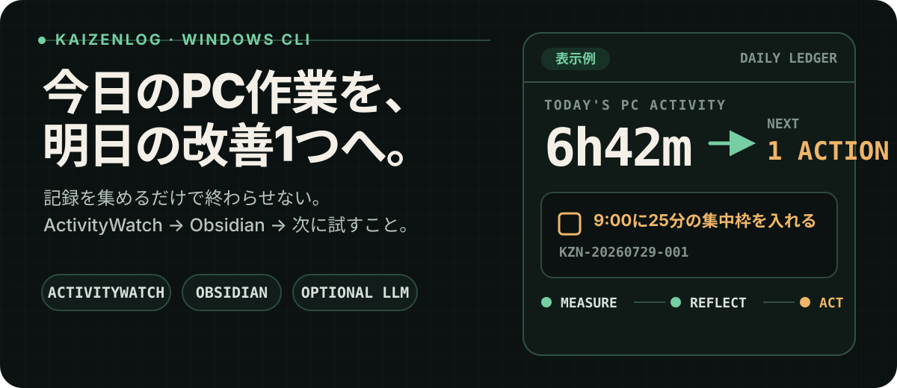
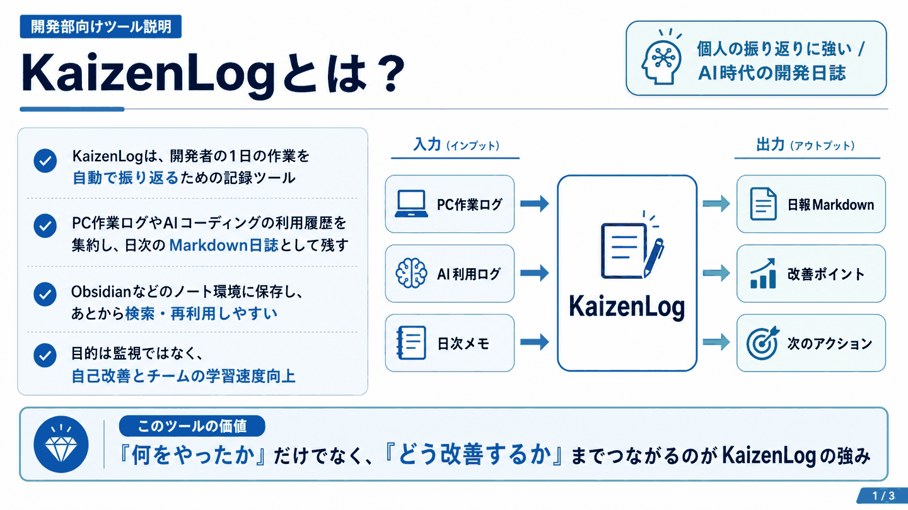
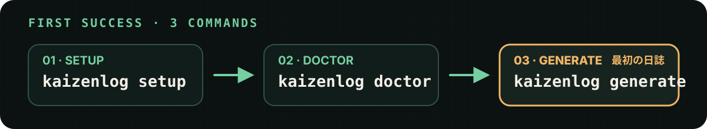
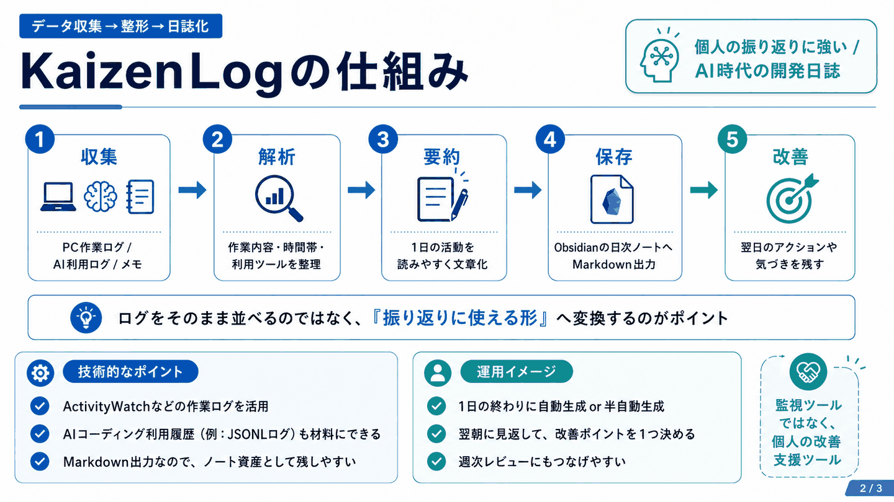
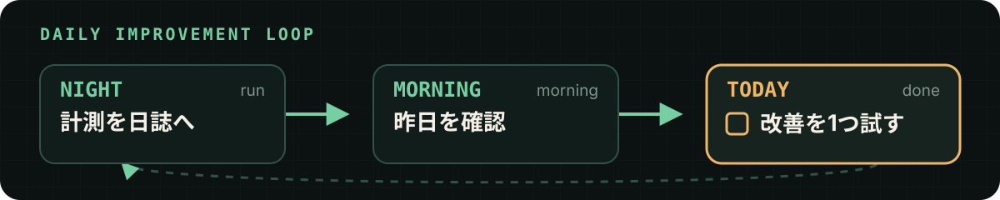
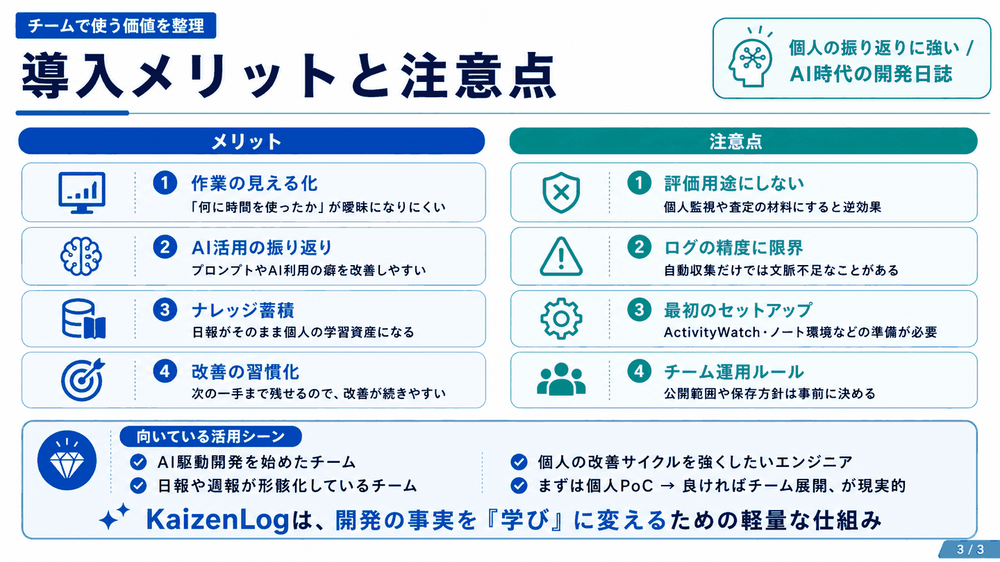

<p align="center">
  
</p>

<h1 align="center">KaizenLog</h1>

<p align="center">
  <b>今日の PC 作業が、毎晩そのまま日誌になる。</b><br>
  ActivityWatch の記録を Obsidian のデイリーノートへ書き込む Windows 向け CLI。<br>
  数値の集計はコードが行い、LLM は「明日試す1件」が欲しい日だけ使います。
</p>

<p align="center">
  
  
  
  
  
  
</p>

<p align="center">
  <a href="#-これは何をするツールか">概要</a> ·
  <a href="#-手に入るもの">手に入るもの</a> ·
  <a href="#-3コマンドで始める">3コマンドで始める</a> ·
  <a href="#-毎日の使い方">毎日の使い方</a> ·
  <a href="#-発展-ai-のやり直しを測って次に活かす">AI改善ループ</a> ·
  <a href="#-llm-とデータの扱い">データの扱い</a> ·
  <a href="docs/USAGE.md">全コマンド</a>
</p>

---

## 🧭 これは何をするツールか

<p align="center">
  
</p>

> 図は概念の整理です。監視ではなく**自分の振り返り**のためのツールで、生産性の点数付けはしません。

---

## ✅ 手に入るもの

夜に1コマンド叩くと、その日の Obsidian デイリーノートに **活動日誌・日報ドラフト・未完了アクション**が並びます。
**LLM の設定はここまで不要です。**

> 以下は架空の入力を実際のレンダラに通した出力です。数値・文言は説明用であり、利用者実績や効果保証ではありません。

```markdown
## 📌 今日やること（1件）

- [ ] KZN-20260802-001:
  - いつ: 午前と午後のアラームが鳴ったとき
  - やる: 30分タイマーをかけ、その時点で使っているカテゴリのアプリ以外を最小化する
  - 完了条件: 今日の予定分を実施して `kaizenlog done KZN-20260802-001`
  - 効果目標: 1時間あたりのカテゴリ変更回数 を 65 以下 に
  - 効果指標: 1時間あたりのカテゴリ変更回数 を 65 以下 に
  - 測定: 未判定（集計待ち・判定不成立・稼働22.7分/必要60分・分母不足）
  - 因果の範囲: 日全体の観測値。特定の実施区間だけの効果は判定できません

## 📈 効果モニタリング（今日やることではない）

- KZN-20260727-002
  - 最新: 8/2 3.2 ✅
  - 直近5日: 4/5達成・未達1日（目標 >= 2.5）
  - 集計範囲: 全AI 22セッション。特定AIツール単独の効果は判定できません

## 🎯 日次目標

- 目標: 提案書の初稿を出す
  - 達成度: 未入力

## 🗂 状況・全件

今週の提案は2件（未チェックの実験が残っています）。うち1件はチェックなしで指標が目標に達しています（指標は達成済み 1件）。

## 📊 Activity Log
合計 5h37m / 集中ブロック 3h02m
AI作業 39% · ブラウジング 29% · …

## 📝 日報ドラフト
【本日の業務】プロジェクト別の依頼要約とセッション数
【成果・進捗】コミット件数と主な内容（取得できた場合）
```

**「今日やること」と「効果モニタリング」は分かれています。** チェックボックスが付くのは今日実行する候補だけで、判定済みの指標追跡はチェックなしで別枠に出ます。「やったつもり」で消化率が動かない作りです。

| これはやる | これはやらない |
| --- | --- |
| その日の PC 作業をカテゴリ・タイムライン付きで日誌にする | 生産性の「点数」や人格評価を出す |
| 未完了の改善アクションを翌朝ノートに出す | 手書きメモを上書きする |
| 指標が測れない日は「未判定」と書く | 観測が無い日を達成・未達に丸める |
| （任意）LLM で「明日試す1〜3件」を提案する | LLM に事実の集計やファイル全体の編集を任せる |
| （発展）AI セッションの空転・依頼の再利用を測る | 効果を保証する・未知の数値を埋めて断定する |

**手書きは消えません。** 更新するのは管理マーカー区間（`kaizenlog:…`）だけで、その外側の本文はそのまま残ります。
「振り返り」「明日の目標」は本人が書く欄で、自動では書きません。

---

## 🚀 3コマンドで始める

<p align="center">
  
</p>

**前提** — Windows 10 / 11 ・ Python 3.11 以上と [pipx](https://pipx.pypa.io/) ・ Obsidian ボールト ・ [ActivityWatch](https://activitywatch.net/)（`setup` が検出し、許可したときだけ導入を案内）

```powershell
git clone https://github.com/awano27/KaizenLog-.git
cd KaizenLog-
pipx install .

kaizenlog setup                          # 1. 設定ウィザード（ボールト・タイムゾーン）
kaizenlog doctor                         # 2. AW 接続と書き込み先の診断
kaizenlog generate --date 2026-08-02     # 3. その日の日誌を作る（LLM 不要）
```

| コマンド | 役割 |
| --- | --- |
| `setup` | 設定ウィザード（ボールト・タイムゾーンなど） |
| `doctor` | ActivityWatch 接続・書き込み先の診断 |
| `generate --date …` | **その日の日誌だけ**作る（決定論・初回向き） |

設定の既定場所は `%APPDATA%\kaizenlog\config.toml` です。
日付なしの `generate` や `run` は追いつき処理を含むことがあるため、**初回は日付付き `generate` を推奨**します。

---

## 📅 毎日の使い方

**朝に目標を書く → 日中は自動記録 → 夜に日誌を作る → 必要な日だけ AI 提案 → 翌日 `done`。**
AI を使わない日でも、日誌と工数の下書きは作れます。

<p align="center">
  
</p>

> ③ の「要約」はコードによる決定論の集計です。文章での改善提案だけが任意の LLM を使います。

```powershell
# 朝（任意）
kaizenlog goal "提案書の初稿を完成させる @執筆・ノート"
kaizenlog morning --skip-catch-up    # 表示だけ。追いつき無し

# 夜 — 日誌のみ（LLM 不要）
kaizenlog generate --date YYYY-MM-DD

# 夜 — 日誌 + 改善提案（LLM 設定が必要）
kaizenlog run

# アクションの確認・完了
kaizenlog today
kaizenlog done KZN-20260801-001
```

| コマンド | いつ | メモ |
| --- | --- | --- |
| `goal "…"` | 朝 | ノートに今日の目標を書く |
| `morning` | 朝 | 未完了アクション再掲。`--skip-catch-up` で安全確認向け |
| `generate` | 夜 | Activity Log / 日報ドラフトなど（決定論） |
| `run` | 夜 | `generate` のあと `advise`（LLM） |
| `today` / `done` | 随時 | 実行できる候補だけを一覧（効果モニタリングは件数のみ）と完了記録 |

`kaizenlog run` は `generate` と `advise` を順に実行します。
`backend = "none"` の状態で `advise` を呼ぶと、LLM 生成を行わずエラーとして終了します。日誌だけなら `generate` を使ってください。
日々の LLM 提案は現在の契約どおり1〜3件です。振り返りを翌日の改善提案へ反映するときだけ、設定済みの LLM バックエンドを使います。
`kaizenlog today` が出すのは実行できる候補だけで、判定済みの指標は `効果モニタリング N件（今日の候補ではありません）` と件数だけ表示されます。観測値が取れない日は達成・未達に丸めず「未判定」と表示します。

### 手書きは消えない

管理マーカー区間だけを更新し、その外側の手書き本文を置換しません。

```markdown
## 振り返り

午前は執筆に集中できた。午後は会議後の再開に時間がかかった。
```

この外側の本文は置換しません。`advise` を使う日は、`## 振り返り` を本人の文脈として優先します。

<details>
<summary><b>使い方の例（開発者 / 企画・営業 / ライター）</b></summary>

> 数値と文章はすべて架空の例です。実在する利用者のデータ、導入実績、改善効果ではありません。
> 各例のカテゴリ時間は主な内訳であり、合計時間の完全な内訳ではありません。

**1. ソフトウェア開発者**
- 自動記録: 6時間12分｜実装 3時間05分｜レビュー 1時間20分｜会議 50分
- 自分の振り返り（手書き）: 会議後に開発へ戻るまで時間がかかった
- 明日の目標（自分で設定）: 午前中にレビュー対応を終える

**2. 企画・営業**
- 自動記録: 5時間48分｜顧客会議 2時間10分｜提案書 1時間45分｜調査 1時間05分
- 自分の振り返り（手書き）: 会議が続き、提案書の作成が夕方に偏った
- 明日の目標（自分で設定）: 最初の会議までに提案書の骨子を作る

**3. ライター・研究者**
- 自動記録: 5時間30分｜執筆 2時間35分｜調査 1時間50分｜推敲 45分
- 自分の振り返り（手書き）: 午前の調査が長引いたが、午後は執筆に集中できた
- 明日の目標（自分で設定）: 調査を90分で区切り、初稿へ進む

</details>

> **測れる範囲について** — Activity Log は ActivityWatch が観測した PC 前景活動の記録です。生活全体の記録ではなく、勤務時間・目標達成・集中力・生産性を判定するものでもありません。スマートフォン、他デバイス、離席中の行動は既定では測定できません。入力 watcher から統計を取得できる場合は、25分以上入力が続いた区間を「集中ブロック」として表示します。

---

## 🔁 発展: AI のやり直しを測って次に活かす

日誌が安定してからで十分です。
やり直しのムダを測る · 効果の高い依頼方法を見つける · 学んだルールを次の AI へ渡す · 改善効果を実測する — を**同じ計測データ**で見ます。

<p align="center">
  
</p>

```powershell
# 見る
kaizenlog status
kaizenlog prompts --roi

# 教える（まず dry-run）
kaizenlog handoff --dry-run
kaizenlog coach --dry-run

# 効いたか確かめる
kaizenlog abtest new --predict +30 --days 28
kaizenlog abtest status
kaizenlog abtest finish --felt +20
```

| 機能 | ひとこと |
| --- | --- |
| **Loop Tax** | リトライ連鎖のうち、最終試行を除くムダ（時間が主。トークンは取れたときだけ） |
| **Prompt ROI** | 繰り返し依頼の再発と、スキル化後の変化 |
| **handoff** | 実測された教訓をエージェント用コンテキストへ（マーカー範囲のみ再生成） |
| **coach** | 提案ファイル作成。書き込みは `coach --apply <file>` のみ |
| **abtest** | 予測・体感・実測。baseline 不足なら「不成立」（数字を作らない） |

通常の `coach` は提案ファイルと diff を作成します。管理対象の coach 区間へ書き込むのは `coach --apply <proposal-file>` だけです。
取得できないトークンや費用は「不明」のままにします。推定で穴埋めして効果を断定しません。

<details>
<summary><b>その他の補助コマンド</b></summary>

```powershell
kaizenlog rehumanize --days 30          # 過去ノートの機械構文を平文に（既定は差分のみ、--write で反映）
kaizenlog excavate                      # 過去の空転をさかのぼって監査
kaizenlog guard install --write         # セッション中の空転をフックで警告（明示時のみ）
kaizenlog screenpipe-probe --minutes 30 # screenpipe 疎通（有効化時・既定 OFF）
```

</details>

### ブラウザ AI と M365 Copilot

| 状態 | 内容 |
| --- | --- |
| **利用可** | Chrome 拡張で ChatGPT / Claude.ai / Gemini の会話イベントをローカル JSONL へ（詳細は [browser-extension/README.md](browser-extension/README.md)） |
| **Next / Planned** | M365 Copilot 改善アシスト（**現在未実装**） |

M365 Copilot は、会話の自動取得、Microsoft Graph／テナント連携、自動送信、カスタム指示の自動変更にまだ対応していません。
参考: [customize-how-microsoft-365-copilot-responds-to-you](https://learn.microsoft.com/en-us/microsoft-365-copilot/extensibility/customize-how-microsoft-365-copilot-responds-to-you) / [declarative-agent-instructions](https://learn.microsoft.com/en-us/microsoft-365-copilot/extensibility/declarative-agent-instructions)

---

## 🔒 LLM とデータの扱い

集計・分類・Obsidian への保存はローカルです。外部送信の有無は LLM バックエンド次第です。

| `backend` | 送信先 |
| --- | --- |
| `"none"` | 送らない（`advise` はエラー） |
| `"openai-compatible"` | 設定した endpoint（ローカル／リモートどちらもありうる） |
| `"claude-code-cli"` | ローカル Claude Code CLI |
| `"copilot-cli"` | ローカル GitHub Copilot CLI |

- `openai-compatible` は設定した endpoint へ送信します。endpoint はローカルとは限りません。
- `fallback_to_local=true` で CLI 失敗時だけ OpenAI 互換へ切り替えます。その endpoint が常にローカルとは限りません。
- `[privacy] redact_patterns` は送信直前のベストエフォートな正規表現マスクです。
- `kaizenlog advise --dry-run` でマスク後の送信予定文を確認できます（元ノートは書き換えません）。
- 更新するのは管理マーカー区間だけです。

詳細は [プライバシー](docs/USAGE.md#プライバシーについて) を参照してください。

---

## 💠 向いている使い方と注意点

<p align="center">
  
</p>

> 図は導入検討のための観点整理です。KaizenLog 自体はローカルの個人ツールで、**チーム共有や集計の機能は実装していません**。図中の「チーム運用ルール」は、ノートを共有する場合に人が決めることを指します。

---

## ⚠️ 制限とカスタマイズ

- 測れるのは主に **PC 前景アプリ**です。スマホ・他端末・離席は既定では測りません。
- カテゴリ時間の増減は「集中が良くなった」ではなく、別画面への移行を示すことがあります。
- LLM の提案は事実ではありません。Activity Log と注記を見て判断してください。
- 日誌のタイムラインは抜粋です。短いブロックの多くは「細切れ」にまとまります。

カテゴリは設定で足せます。

```toml
[[categories.rules]]
name = "AI作業"
ai = true
patterns = ["dify", "自社チャットボット"]
```

全コマンド・実験・評価は [docs/USAGE.md](docs/USAGE.md) にあります。

---

## 🛠 開発

```powershell
git clone https://github.com/awano27/KaizenLog-.git
cd KaizenLog-
python -m venv .venv
.\.venv\Scripts\Activate.ps1
pip install -e ".[dev]"
pytest
```

変更履歴は [CHANGELOG.md](CHANGELOG.md)。

## 🗺 ロードマップ

- [x] ActivityWatch から Markdown 日誌
- [x] 改善提案（advise）とアクション転記
- [x] Prompt ROI / handoff / coach / A/B
- [x] Claude Code・Copilot CLI・OpenAI 互換
- [x] ブラウザ AI テレメトリ
- [x] [screenpipe](https://github.com/mediar-ai/screenpipe) 連携（既定 OFF・参考層）
- [ ] M365 Copilot 改善アシスト
- [ ] Cursor など追加 AI ログ

## 📄 ライセンス

[MIT License](LICENSE)。ActivityWatch は別プロセスとして REST API 経由で使い、同梱しません。
